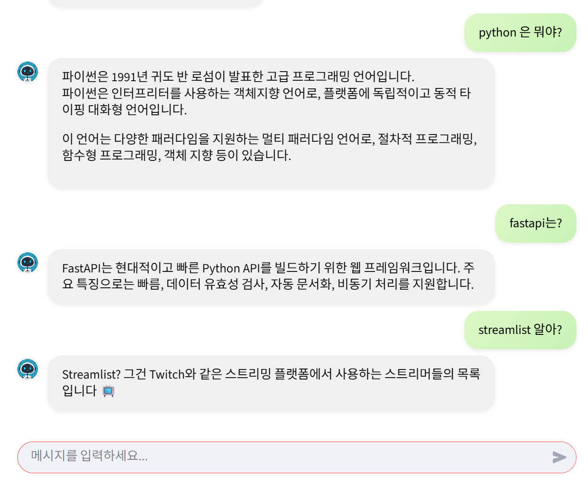
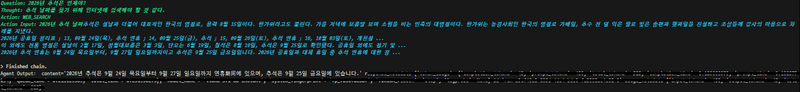
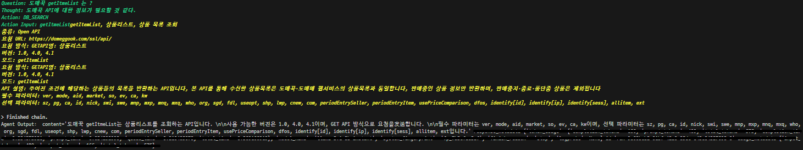

# 🤖 FastAPI Agent Chatbot

LangChain 기반의 **RAG(Retrieval Augmented Generation)** 구조를 활용한 대화형 AI 챗봇입니다.
내부 데이터(VectorDB) 검색과 Google 웹 검색을 스스로 판단해 사용하는 **능동형 AI 에이전트**를 구현하였습니다.
백엔드는 **FastAPI**, 프론트엔드는 **Streamlit**으로 구성되어 있으며,
비동기 처리와 RAG 아키텍처를 통해 정확하고 빠른 응답을 제공합니다.
또한 LangSmith를 통한 모니터링과 추적, 다양한 프롬프트 버전을 테스트하고 비교할 수 있도록 수현하였습니다.


## 🚀 주요 기능

- 💬 **자연어 질의 응답** : Llama3 기반 LLM을 활용해 사용자의 질문을 분석하고 정확한 답변을 제공합니다.
- 🧠 **RAG 기반 유사도 검색** : VectorDB(Qdrant)에 임베딩된 문서를 검색하여 관련 정보를 제공합니다.
- 🌐 **웹 검색 (Google)** : 내부 문서에 없는 정보는 SERP(Search Engine Results Page)를 통해 최신 정보를 검색합니다.
- ⚡ **비동기 API 구조** : FastAPI의 비동기 처리로 높은 성능을 유지합니다.
- 🧩 **LangChain Agent 구성** : VectorDB, Google Search 등의 도구를 결합해 자율적인 에이전트 동작을 수행합니다.


## 🛠️ 기술 스택

### 🖥 Backend & Frontend
- **Python**
- **FastAPI**
- **Streamlit**
- **VectorDB (Qdrant)** : 문서 임베딩 기반 유사도 검색 (Cosine Similarity)**

### 🤖 LLM / RAG
- **LangChain**
- **Llama3**
- **Sentence Transformers**
- **Google**

### ⚙️ DevOps / LLMOps
- **Docker** - 컨테이너화
- **LangSmith** - 모니터링 및 추적


## 📸 실행 화면






## 📂 프로젝트 구조

```
fastapi-chatbot/
├── app/                           # 애플리케이션 코드
│   ├── api/                       # API 엔드포인트 정의
│   │   ├── v1/                    # API 버전 1
│   │   │   ├── agent/             # 에이전트 관련 API
│   │   │   │   └── chatbot/       # 챗봇 관련 라우트
│   │   │   └── vectordb/          # 벡터DB 관련 API
│   │   └── router_collector.py    # 라우터 통합 관리
│   │
│   └── domain/                    # 도메인 로직
│       └── agent/                 # 에이전트 도메인
│           ├── modules/           # 모듈 구현
│           │   ├── llm/           # LLM 관련 모듈 (Groq 등)
│           │   ├── search/        # 검색 관련 모듈 (SerpAPI 등)
│           │   └── vectordb/      # 벡터DB 관련 모듈 (Qdrant 등)
│           └── services/          # 비즈니스 로직 서비스
│
├── common/                        # 공통 유틸리티
│   ├── constants/                 # 상수 정의
│   │   └── agent/                 # 에이전트 관련 상수 (모델, 임베딩, 도구 등)
│   ├── exceptions/                # 예외 처리 핸들러
│   └── utils/                     # 유틸리티 함수 (응답, 프롬프트, 라우터 등)
│
├── config/                        # 설정 파일
│   └── settings.py               # 애플리케이션 설정
│
├── model/                        # 학습된 모델 또는 모델 관련 파일
│
├── storage/                      # 파일 저장소
│   ├── logs/                     # 로그 파일
│   ├── screenshots/              # 스크린샷
│   ├── serp/                     # 검색 결과 저장
│   ├── uploads/                  # 사용자 업로드 파일
│   └── vectordb/                 # 임베딩 데이터
│       └── data/
│           ├── board/            # 게시판 데이터
│           └── dev/              # 개발 데이터
│
├── .env.example                  # 환경 변수 예시
├── docker-compose.yml            # Docker 설정
├── main.py                      # 애플리케이션 진입점
└── requirements.txt             # Python 의존성
```