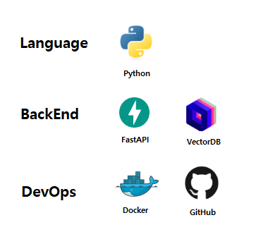

# FastAPI Chatbot

FastAPI 기반의 챗봇 애플리케이션입니다. 이 프로젝트는 대화형 AI 에이전트 챗봇으로서 Googel 검색 기능과 벡터 데이터베이스를 활용한 DB 검색 기능을 스스로 결정하고 사용하는 내리는 능동적인 챗봇 기능을 제공합니다.


## 🚀 주요 기능

- **챗봇**: 사용자와 자연스러운 대화가 가능한 AI 에이전트
- **VectorDB 검색**: Qdrant를 활용한 효율적인 벡터 검색 기능
- **Google 검색**: SERP(Search Engine Results Page)를 통한 웹 검색 기능
- **RESTful API**: FastAPI 기반의 확장 가능한 API 구조
- **비동기 처리**: Async/await를 활용한 비동기 처리로 높은 성능 유지


## 🛠️ 기술 스택



- **백엔드**: FastAPI 0.110.0 (Python 3.11)
- **VectorDB**: Qdrant 1.15.1
- **AI/ML**:
  - Transformers 4.43.0 (Hugging Face)
  - Sentence Transformers 5.1.0 (임베딩 모델)
  - PyTorch 2.2.0
  - LangChain 0.2.17
- **데이터베이스**:
  - SQLAlchemy 2.0.35 (ORM)
  - Alembic 1.13.1 (마이그레이션)
  - Motor 3.7.1 (MongoDB)
- **검색 & API**:
  - Google API Client 2.97.0
  - SerpAPI 2.4.2 (웹 검색)
  - HTTPX 0.25.1 (비동기 HTTP 클라이언트)
- **유틸리티**:
  - Pydantic 1.10.12 (데이터 검증)
  - Pandas 2.1.1 (데이터 처리)
  - NumPy 1.26.4
  - python-decouple 3.8 (환경 변수 관리)


## 📌 주요 버전 정보

### 핵심 의존성
- **Python**: 3.11
- **FastAPI**: 0.110.0
- **PyTorch**: 2.2.0
- **Transformers**: 4.43.0
- **Qdrant Client**: 1.15.1
- **LangChain**: 0.2.17

### 데이터베이스
- **SQLAlchemy**: 2.0.35
- **Alembic**: 1.13.1
- **Motor**: 3.7.1
- **Beanie**: 1.27.0

### 검색 & API
- **Google API Client**: 2.97.0
- **SerpAPI**: 2.4.2
- **HTTPX**: 0.25.1
- **Groq Client**: 0.31.1


## 📸 실행 화면


## 📂 프로젝트 구조

```
fastapi-chatbot/
├── app/
│   ├── api/                 # API 라우트 정의
│   ├── domain/              # 도메인 로직
│   │   └── agent/           # 챗봇 에이전트 관련 로직
│   │       ├── modules/     # LLM, 검색, 벡터DB 모듈
│   │       └── services/    # 비즈니스 로직 서비스
│   └── ...
├── common/                  # 공통 유틸리티
│   ├── constants/           # 상수 정의
│   ├── exceptions/          # 예외 처리
│   └── utils/               # 유틸리티 함수
├── config/                  # 설정 파일
├── storage/                 # 파일 저장소
│   ├── screenshots/         # 스크린샷
│   ├── serp/                # 검색 결과 저장
│   └── vectordb/            # 벡터DB 데이터
├── .env.example             # 환경 변수 예시
├── docker-compose.yml       # Docker 설정
├── main.py                 # 애플리케이션 진입점
└── requirements.txt        # Python 의존성
```