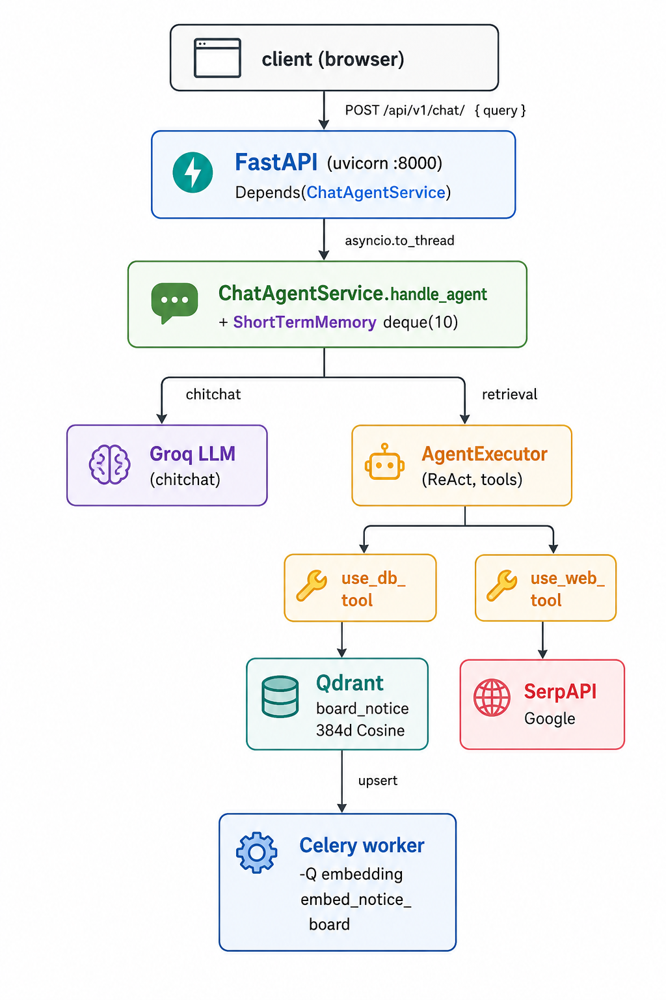
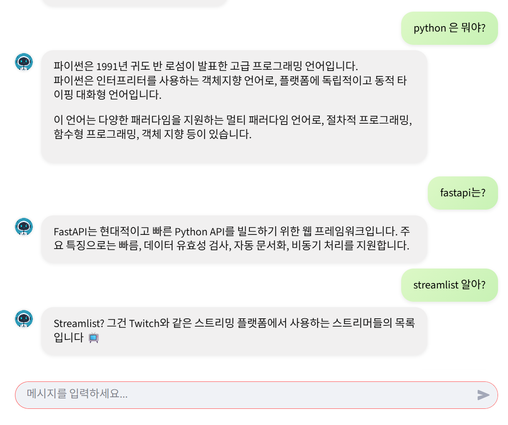
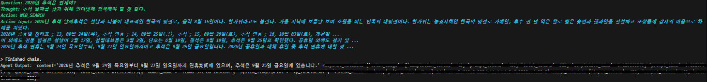
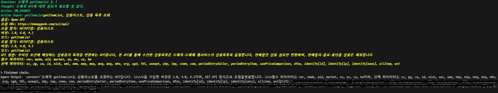

# 챗봇 에이전트 API

LangChain ReAct 에이전트 기반 대화형 챗봇 API.

사용자 질문을 **일상 대화 / 정보 요청**으로 분류한 뒤, 정보 요청이면 ReAct 에이전트가
`use_db_tool`(Qdrant 벡터 검색) 또는 `use_web_tool`(SerpAPI) 중 하나를 스스로 선택해 호출하고,
그 결과를 컨텍스트로 최종 답변을 생성합니다. 대화는 `deque(maxlen=10)` 단기 메모리에 누적됩니다.



---

## 기술 스택

| 영역 | 사용 기술 |
|---|---|
| API | FastAPI, Uvicorn, Pydantic v2 |
| LLM / 에이전트 | LangChain (ReAct AgentExecutor), Groq `llama-3.1-8b-instant` |
| 임베딩 | sentence-transformers `all-MiniLM-L6-v2` (384차원) |
| VectorDB | Qdrant v1.15.4 — `board_notice` 컬렉션 (384차원, Cosine) |
| RDB | MySQL (SQLAlchemy 2.0.49, Alembic) |
| 웹 검색 | Serp |
| 비동기 작업 | Celery + Redis, Flower |
| 패키지 관리 | uv |

---

## 디렉토리 구조

```text
fastapi-chatbot/
├── app/
│   ├── api/
│   │   ├── __init__.py                 # /api 루트 + pkgutil 자동 수집
│   │   └── v1/
│   │       ├── __init__.py             # /v1 + 하위 라우터 자동 등록
│   │       └── chat/
│   │           └── router.py           # POST /api/v1/chat/
│   ├── core/
│   │   ├── config.py                   # pydantic-settings 환경 설정, BASE_DIR, STORAGE_PATH
│   │   ├── logging.py                  # 로깅 초기화
│   │   ├── dependencies/
│   │   │   ├── common.py               # get_qdrant_client / get_embedding_model / get_groq (lru_cache) + get_qdrant
│   │   │   └── chat.py                 # Serp / DBSearch / WebSearch / ChatAgentService 팩토리
│   │   ├── exceptions/
│   │   │   ├── custom.py               # BusinessException
│   │   │   └── handler.py              # 글로벌 예외 핸들러 등록
│   │   └── utils/
│   │       └── response.py             # success_response / error_response 헬퍼
│   ├── infrastructure/
│   │   ├── storage/board.py            # 게시판 공지 로더
│   │   └── vectordb/qdrant.py          # Qdrant 클라이언트 래퍼 (client 주입형)
│   ├── modules/
│   │   ├── llm/
│   │   │   └── groq.py                 # Groq 래퍼
│   │   ├── memory/
│   │   │   └── short_term.py           # ShortTermMemory (deque(maxlen=10))
│   │   ├── prompt/
│   │   │   └── chat.py                 # CHAT_PROMPTS (chitchat.confirm / chitchat.output / result.output)
│   │   ├── search/
│   │   │   └── serp.py                 # Serp (SerpAPIWrapper 호출 + 응답 파싱 통합)
│   │   └── tools/
│   │       ├── db_search.py            # DBSearch (qdrant + embedding 주입)
│   │       ├── web_search.py           # WebSearch (Serp 주입)
│   │       └── tool.py                 # build_db_search / build_web_search 클로저 팩토리
│   ├── schemas/
│   │   ├── base.py                     # SuccessResponse 제네릭
│   │   └── chat/
│   │       ├── request.py              # ChatAgentRequest
│   │       └── response.py             # ChatAgentResponse (= SuccessResponse[dict])
│   ├── services/
│   │   ├── agent/
│   │   │   └── chat.py                 # ChatAgentService (chitchat 분기 + ReAct executor)
│   │   └── point/
│   │       └── notice_board.py         # NoticeBoardPointService (공지 임베딩 적재)
│   ├── worker/
│   │   ├── celery_app.py               # Celery 앱 (queue: embedding)
│   │   └── tasks/
│   │       ├── embedding.py            # embed_notice_board (lru_cache 캐시 함수 직접 호출)
│   │       └── test.py                 # 샘플 add 태스크
│   └── main.py                         # FastAPI 진입점 (lifespan 워밍업, CORS, 예외 등록)
├── config/
│   ├── embedding_model.py              # 임베딩 모델 메타 (all-MiniLM-L6-v2)
│   └── llm_model.py                    # LLM 모델 메타 (llama-3.1-8b-instant)
├── docs/
│   └── 01 refactoring.md               # 리팩토링 노트
├── notebooks/                          # Jupyter 탐색 노트북
├── storage/
│   ├── embedding/board/notice.py       # 임베딩 대상 공지 데이터
│   ├── serp/response.json              # SerpAPI 샘플 응답 (개발용)
│   └── screenshots/                    # README 스크린샷
├── tests/
│   └── test_sample.py
├── docker-compose.yml
├── pyproject.toml
├── uv.lock
└── README.md
```

---

## 실행

```bash
docker compose up -d
```

| 서비스 | 주소 |
|---|---|
| API (Swagger) | http://localhost:9098/docs |
| Flower | http://localhost:5555 |
| Qdrant | http://localhost:6333 |

**사전 조건** — Qdrant `board_notice` 컬렉션을 미리 생성해야 합니다.

```python
vectors_config={"size": 384, "distance": "Cosine"}
```

---

## 처리 흐름

2. **일상 대화** → 질문이 일상적인 대화일 경우 친근체 프롬프트로 답변 생성
3. **정보 요청** →
   - `use_db_tool`: query 임베딩 → Qdrant `board_notice` top-k=5 검색
   - `use_web_tool`: SerpAPI (`hl=ko`, `gl=kr`) → knowledge_graph + organic_results 상위 3개
4. **결과 합성** — 도구 응답 + 대화 히스토리 + 질문을 컨텍스트로 최종 답변 생성

---

## 임베딩 파이프라인 (Celery)

공지 데이터를 청크 분할·임베딩해 Qdrant 에 적재합니다.
`RecursiveCharacterTextSplitter(chunk_size=100, chunk_overlap=10)` → `SentenceTransformer.encode` → `upsert_points`

```bash
celery -A app.worker.celery_app call app.worker.tasks.embedding.embed_notice_board
```

Flower(http://localhost:5555)에서도 호출·모니터링할 수 있습니다.

---

## 알려진 제한 사항

| 항목 | 내용 |
|---|---|
| 단기 메모리 | `ChatAgentService` 가 요청마다 새로 생성되어 히스토리가 유지되지 않음 → `session_id` 기반 store 필요 |
| SerpAPI | `Serp.run()` 이 실제 호출 대신 `storage/serp/response.json` 샘플을 반환 → 환경 플래그 분기 필요 |
| 임베딩 멱등성 | ID 가 `uuid4` 라 재실행 시 중복 적재 → `uuid5` 결정적 ID 전환 필요 |
| 응답 스키마 | `ChatAgentResponse = SuccessResponse[dict]` 이나 실제 반환은 문자열 |
| 컬렉션 생성 | `board_notice` 자동 생성 미지원 (lifespan 보강 필요) |
| ReAct 반복 | `max_iterations=1` — DB + Web 조합 질의 불가 |
| 테스트 | 샘플만 존재, 실질 커버리지 없음 |

---

## 실행 화면

### 챗봇 UI



### 웹 검색 (`use_web_tool`)



### 벡터DB 검색 (`use_db_tool`)



### 데모

